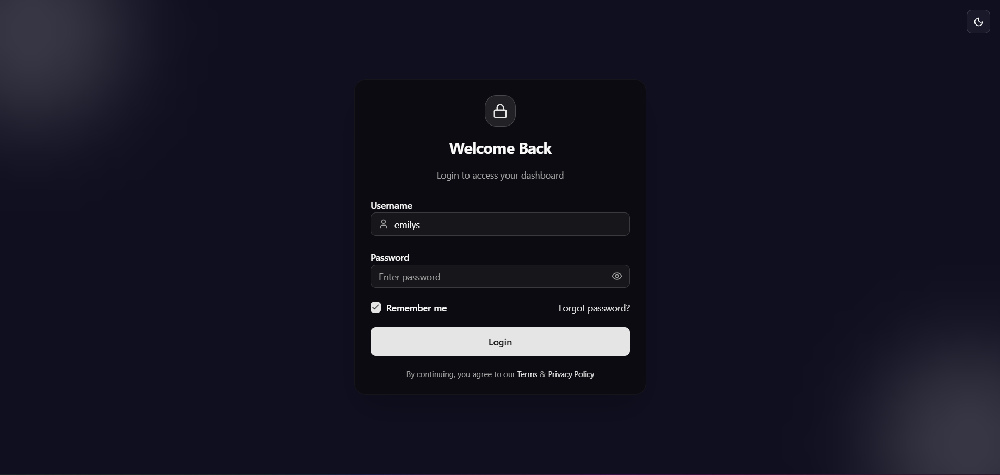
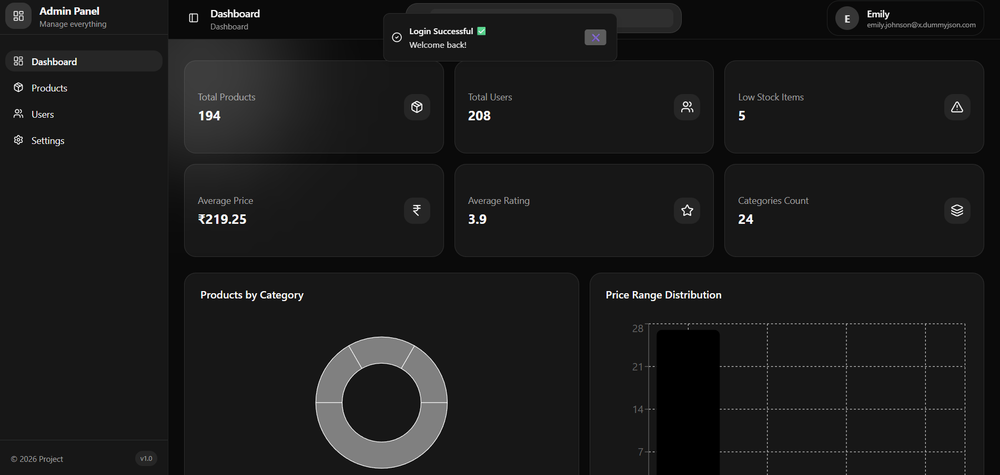
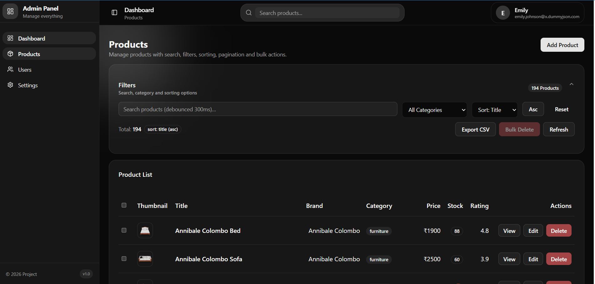

# Admin Panel Dashboard (React + TanStack Query)

## 1. Project Overview
This project is a modern **Admin Dashboard Panel** built using **React + TypeScript** with a clean UI and scalable architecture.  
It supports product management features like:

- Product Listing (Pagination + Filters + Search)
- Create / Update / Delete Products
- Product Details Page
- Global Search in Header
- Users Page (Read Only)
- Settings Page (Theme + Table Density + Page Size + Sidebar State)
- Cloudinary Image Upload Integration
- Token Refresh Authentication Flow
- PWA Support (Offline-ready)

The goal of this project is to provide a **production-ready admin panel template**.

---

## 2. Tech Stack
### Frontend
- **React + TypeScript**
- **React Router**
- **Tailwind CSS**
- **Lucide Icons**
- **Radix UI components**
- Custom UI Components (Shadcn-style)

### State / Data Layer
- **TanStack Query (React Query)**

### API Layer
- **Axios** (with interceptors)
- Token Refresh Implementation (Access + Refresh Token)

### Image Upload
- **Cloudinary Unsigned Upload**

### Extra Features
- **PWA Support** (Service Worker + Offline indicator)
- Toast Notifications (`sonner`)

---

## 3. Setup Instructions

### 3.1 Clone & Install
```bash
git clone <your_repo_url>
cd <your_project_folder>
npm install

4. Architecture Decisions
4.1 Folder Structure Rationale

This project follows a modular and scalable folder structure so that new modules (Orders, Vendors, Reports, etc.) can be added easily without breaking existing code.

src/
 ├── assets/        # Images, icons, static resources
 ├── components/    # Reusable UI components (Button, Table, Modal, Sidebar etc.)
 ├── constants/     # App constants (routes, enums, fixed values)
 ├── helpers/       # Helper utilities (AuthGuard, wrappers, reusable logic)
 ├── hooks/         # Custom hooks (debounce, pagination, settings hooks etc.)
 ├── layouts/       # Layout components (MainLayout, Sidebar Layout)
 ├── lib/           # Core utilities (axios client, toast, storage utils)
 ├── pages/         # Page-level components (Products, Users, Settings)
 ├── routes/        # Routing config + URL definitions
 ├── services/      # API services (product.service.ts, user.service.ts)
 ├── store/         # Zustand state stores (auth, settings, etc.)
 ├── types/         # Global TypeScript types/interfaces
 ├── App.tsx        # App provider wrapper (React Query, Router, Theme)
 ├── main.tsx       # App entry point






✅ AI Tool Usage
"Used ChatGPT for help with UI structure and axios interceptor logic."